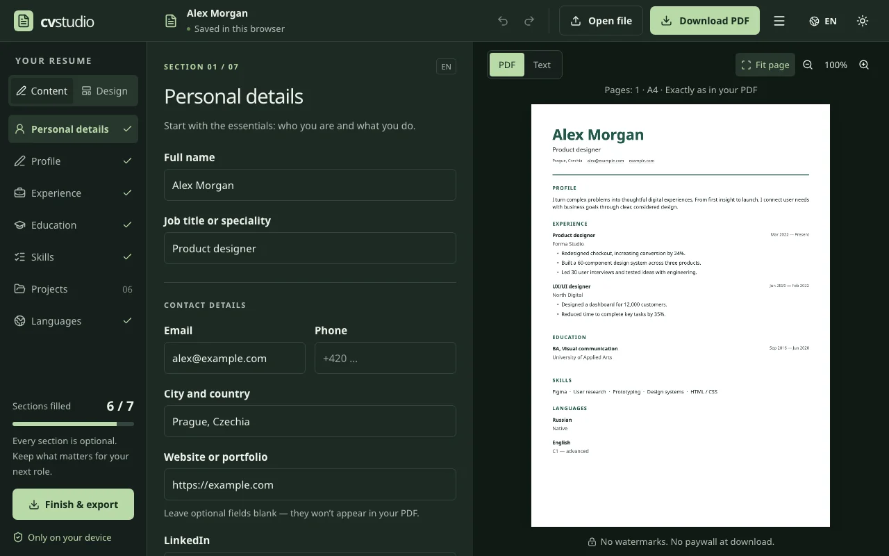
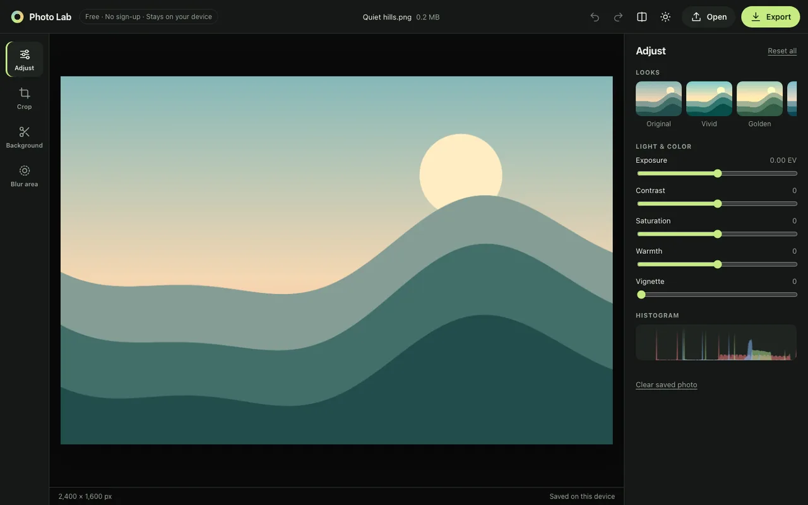
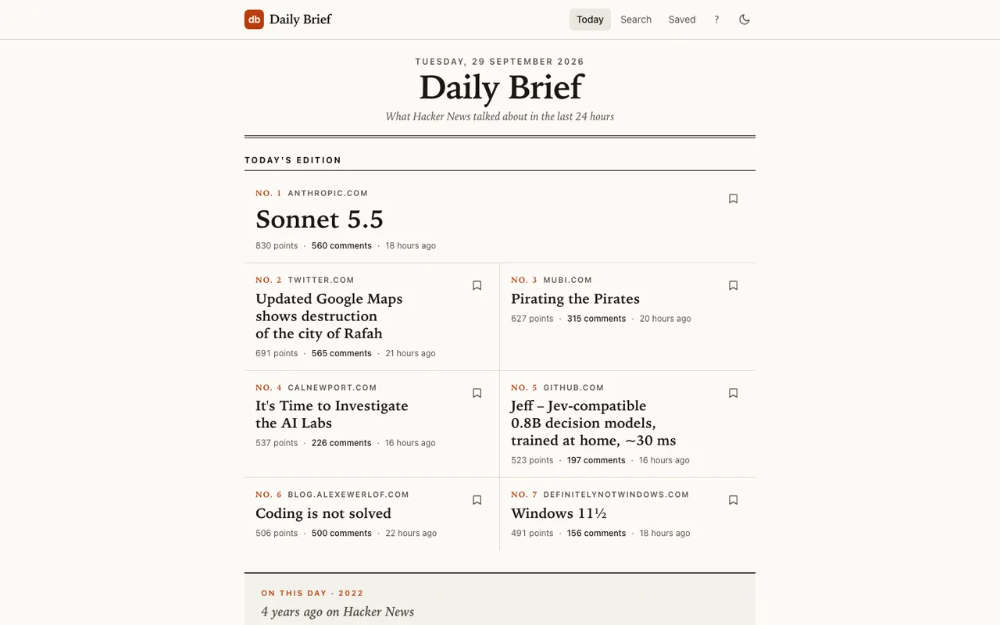
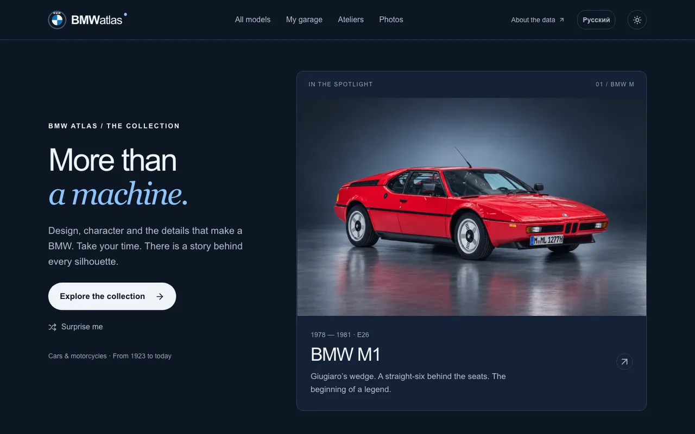
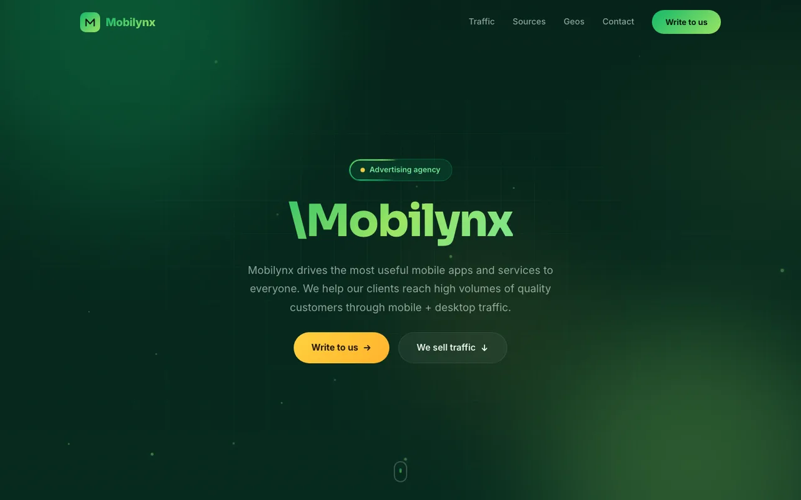

# Nikita — Frontend & Product Engineer

6+ years building web products with Vue, React and TypeScript — and, more and more, the parts around the interface: WebGL image processing, real-time sync, offline data, mobile apps and the API behind them. Based in Europe.

I like products that stay quick and clear as they grow: strict TypeScript, a real design system, and tests that run in CI.

---

## Featured

<table>
<tr>
<td width="50%" valign="top">

### [CV Studio](https://mrnednick.github.io/cv-studio/)

A free resume editor with a live PDF preview, clear templates, clickable links, and editable backups. No account, no download paywall; your resume stays on your device.

React 19 · TypeScript · PDF · [code](https://github.com/MrNedNick/cv-studio)

</td>
<td width="50%" valign="top">

### [Photo Lab](https://mrnednick.github.io/photo-lab/)

A free photo editor in the browser: crop for any feed, straighten, fix colors, remove the background, blur faces and plates. No sign-up; photos never leave the device.

TypeScript · WebGL2 · Web Workers · ONNX · [code](https://github.com/MrNedNick/photo-lab)

</td>
</tr>
<tr>
<td width="50%" valign="top">

### [Daily Brief](https://mrnednick.github.io/daily-brief/)

Today's edition of Hacker News: the biggest stories of the last 24 hours and a story from this day in HN history. Works offline.

Svelte 5 · SvelteKit · [code](https://github.com/MrNedNick/daily-brief)

</td>
<td width="50%" valign="top">

### [BMW Atlas](https://mrnednick.github.io/bmw-atlas/)

An independent BMW encyclopedia: generations, model-year updates, powertrains and production, with a photo for every generation. Source-backed.

React 19 · TypeScript · Tailwind · [code](https://github.com/MrNedNick/bmw-atlas)

</td>
</tr>
</table>

## Live sites

<table>
<tr>
<td width="50%" valign="top">

#### [OXFeeds](https://mrnednick.github.io/oxfeeds-landing/)

Landing for a search-traffic monetization service — partners, traffic sources and a contact form.

Vue 3 · Vite · [code](https://github.com/MrNedNick/oxfeeds-landing)

</td>
<td width="50%" valign="top">

#### [Mobilynx](https://mrnednick.github.io/mobilynx-landing/)

Landing for a mobile performance-traffic network — pricing models, traffic sources and a contact form.

Vue 3 · Vite · [code](https://github.com/MrNedNick/mobilynx-landing)

</td>
</tr>
</table>

## More projects

| Project | What it is | Stack |
|---|---|---|
| **[Frontend Notes](https://mrnednick.github.io/frontend-notes/)** · [code](https://github.com/MrNedNick/frontend-notes) | Notes from real bugs and a measured comparison of five stacks | Astro |
| **[Booking Desk](https://mrnednick.github.io/booking-desk/)** · [code](https://github.com/MrNedNick/booking-desk) | Meeting-room booking with a week grid and conflict checks | Angular 20 |
| **[VibeOS](https://mrnednick.github.io/VibeOS/)** · [code](https://github.com/MrNedNick/VibeOS) | A personal life OS — habits, goals and tasks linked into one system | Vue 3 · Supabase |

---

## Toolbox

**Frontend**  

**Mobile & desktop**  

**Graphics, maps & real-time**  

**Backend & data**  

**Quality & delivery**  

---

## Get in touch

Open to frontend and product engineering roles.

💼 **[LinkedIn](https://www.linkedin.com/in/mrnednick/)** — the best way to reach me.
